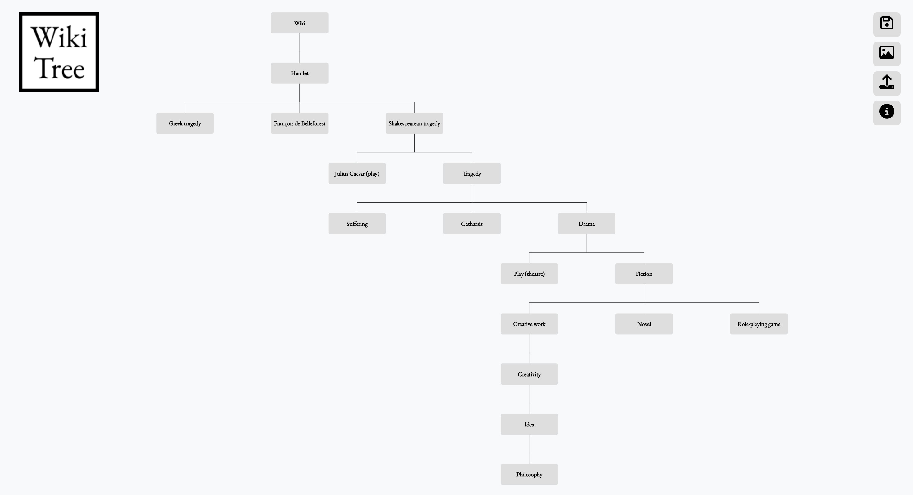

# WikiTree

Visualize your Wikipedia rabbitholes as a Tree

Do you love going down rabbit-holes on Wikipedia but forget how you ended up on a certain page? WikiTree is a fun little tool to help you keep track of all the Wikipedia tabs you've opened. It runs in the background and builds a tree of all your Wiki pages, so you can see exactly what led you to reading about 'Finland in World War II' at 3 in the morning. 

- Click on extension icon to open WikiTree
- See Wiki tabs as Tree Nodes
- Click on node to go to tab
- Zoom/pan
- Save screenshot
- Export tree and share with friends, or save it for later

